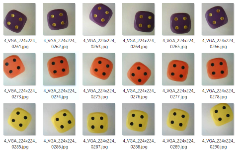
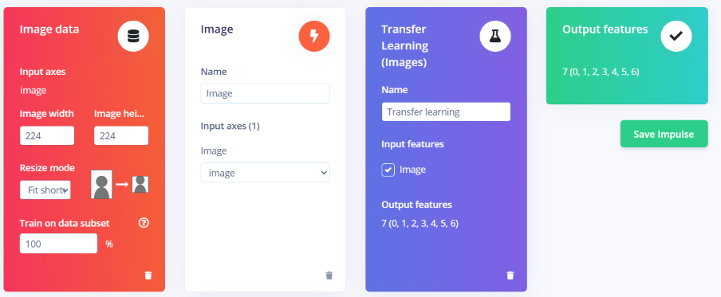
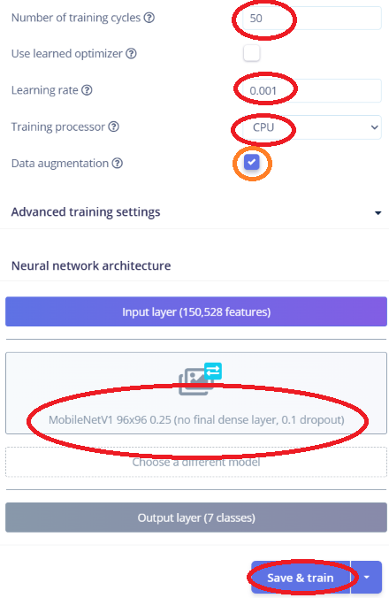
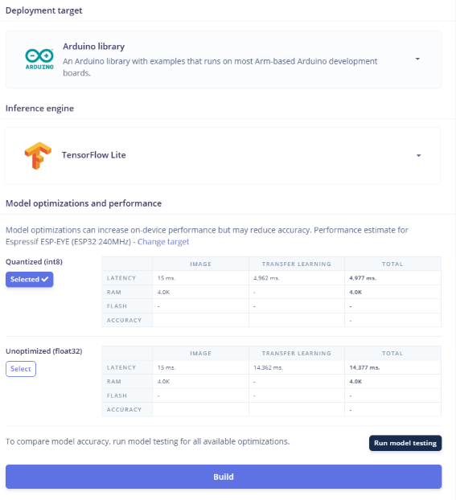

# Arduino ESP32-S3 + Edge Impulse: Find the Right Tensor Arena Size

# 🚀 A Starting Point for Embedded AI on ESP32-S3
**A beginner-friendly guide to image classification with Edge Impulse and TensorFlow Lite Micro**

This guide is a practical starting point for anyone who wants to begin building embedded AI applications on an ESP32-S3, including complete beginners.

It explains the full workflow, from creating and labeling an image dataset in Edge Impulse to training, exporting, and deploying a TensorFlow Lite Micro model on an ESP32-S3. Along the way, it explains the key concepts needed to understand how an image-classification project works on a constrained embedded device.

This project helps answer two crucial questions before deploying an AI model:

1. **Which AI model can run on the ESP32-S3?**
2. **How much TensorFlow Lite Micro tensor arena memory must be allocated for that model?**

The example uses a dice-image-classification model, but the same method can be applied to many other camera-based embedded AI projects.

---

## 👋 Introduction

This repository contains an **Arduino sketch** that measures the **TensorFlow Lite Micro tensor arena** used by an **Edge Impulse model** on an **ESP32-S3** with PSRAM.

Beyond the usual hobbyist and maker applications, the ESP32-S3 also makes it possible to explore original and engaging on-device AI projects at a modest cost. Its dual-core processor, optional PSRAM, Wi-Fi and Bluetooth connectivity, and support for AI and DSP-oriented instructions provide a practical base for image classification, sound recognition, gesture detection, sensor analysis, and connected edge-AI devices.

Together with **[Edge Impulse](https://edgeimpulse.com/)**, ESP32-S3 provides a workflow for collecting data, training a model, exporting an Arduino library, and running inference on a device without having to build the entire machine-learning deployment stack from scratch.

**This repository is intended for Arduino hobbyists and makers who have created an AI model with Edge Impulse and want to deploy it reliably on an ESP32-S3 as an Arduino library.**

> [!NOTE]
> <table>
> <tr>
> <td valign="top">
>
> The example used in this repository is an image-classification model created in Edge Impulse to recognize each face of a die.
>
> The model uses 224×224 pixel images in RGB color format, captured by the OV2640 camera module connected to the ESP32-S3.
>
> </td>
> <td width="240">
> 
> </td>
> </tr>
> </table>

## 🔍 What the sketch does

The Arduino sketch in this repository:

- Prints free internal SRAM heap.
- Prints the largest available contiguous SRAM heap block.
- Prints free and total PSRAM.
- Allocates the Edge Impulse input feature buffer in PSRAM.
- Runs `run_classifier()` once with a zero-filled test input.
- Prints memory usage before and after inference.
- Prints classification output and timing.
- Displays the TFLite Micro tensor-arena measurement after a small debug addition inside the Edge Impulse SDK.

The sketch is a diagnostic and sizing tool. It does **not** replace the camera or sensor code in a final project.

## 📖 A few technical terms

Before continuing, here are two technical terms used throughout this guide:

**TensorFlow Lite Micro** (also called **TFLite Micro** or **TFLM**) is a lightweight C++ runtime designed to run trained machine-learning models directly on microcontrollers and other embedded devices with limited memory.

A **tensor arena** is a single block of RAM reserved in advance for TensorFlow Lite Micro. During inference, the runtime uses this memory to store model inputs, outputs, intermediate activation data, persistent model data, and temporary working buffers.

The arena must be large enough for all these allocations. If it is too small, TensorFlow Lite Micro cannot allocate the model tensors and inference fails. If it is unnecessarily large, it reserves internal SRAM that could otherwise be used by the camera, display, Wi-Fi, or application code.

## 🧠 Understanding ESP32-S3 Memory

The ESP32-S3 uses different types of memory, each with a different role:
- **Flash memory** is long-term storage. It contains the compiled Arduino program, the Edge Impulse library, the TensorFlow Lite Micro model, and other static files. Flash keeps its contents when the board is powered off.

- **Internal SRAM** is the ESP32-S3's fast working memory. It is used while the program runs for variables, stacks, temporary buffers and, by default, the TensorFlow Lite Micro tensor arena. Internal SRAM is limited, so the tensor arena size must be chosen carefully.

- **PSRAM** is additional external working memory available on some ESP32-S3 boards. It is larger than internal SRAM but generally slower. In this sketch, PSRAM is used for the large input image buffer, preserving internal SRAM for the TensorFlow Lite Micro tensor arena and the rest of the application.

Both internal SRAM and PSRAM are volatile: their contents are cleared when the board is reset or powered off.

- **microSD card** is removable, non-volatile file storage. It can hold large datasets, captured camera images, logs, configuration files, or other user files, and it keeps its contents when the board is powered off. Unlike Flash, it does not normally store or run the Arduino program; unlike SRAM and PSRAM, it is not working memory for variables or the TensorFlow Lite Micro tensor arena. The ESP32-S3 reads and writes files on the card through an SDMMC or SPI interface.

---

## 🎯 Why this repository exists

When developing and deploying an on-device AI project on an ESP32-S3, two stages of the process require particularly careful choices:

1. Choosing an AI model in Edge Impulse that can actually run on an ESP32-S3. Edge Impulse offers many learning blocks, model architectures, and deployment options, but not every combination is suitable for the memory and performance limits of the ESP32-S3 board.

2. Deploying the model as an Arduino library and selecting the correct TensorFlow Lite Micro tensor arena size.

**This repository provides concrete, measured information about both critical points: choosing an Edge Impulse AI model that can run on an ESP32-S3, and configuring the required TensorFlow Lite Micro tensor arena memory. It helps avoid a situation where a model trains successfully but cannot be deployed or run reliably on the ESP32-S3.**

It is the result of many tests carried out to find a working combination of model, input size, deployment settings, memory configuration, and tensor arena size. By making this work public, the goal is to save time for hobbyists and makers who want to start a similar project.

## 📌 A practical ESP32-S3 model reference

The example behind this repository is an Edge Impulse image-classification project designed to recognize each face of a die. After many tests, the following combination was found to run on an ESP32-S3:

- Impulse image size: **224 x 224 RGB**
- Edge Impulse learning block: **Transfer Learning (Images)**
- Base model: **MobileNetV1 96x96 0.25**
- DSP time: approximately **71 ms**
- Neural-network classification time: approximately **429 ms**
- Total inference time: approximately **500 ms**
- Theoretical inference rate: approximately **2 images per second**
- Practical rate: close to **2 images per second**, before including camera capture, image conversion, display, Wi-Fi, logging, or other application tasks.

For this dice recognition project, a lower image resolution or grayscale images instead of RGB would probably have been sufficient, reducing the model's memory requirements and inference workload. The purpose of configuring the Edge Impulse impulse at 224 x 224 RGB was to explore the highest practical image resolution that could be processed on an ESP32-S3 for more demanding future projects.

In Edge Impulse, the image width and height selected in **Impulse Design > Create Impulse** define the image size processed by the Image data block and expected by the exported classifier. In this project, the impulse is configured for 224 x 224 RGB images.

The `96x96` part of the `MobileNetV1 96x96 0.25` name refers to the model's pre-training and nominal input resolution. Edge Impulse documents 96 x 96 as the model's optimal input resolution, but it also allows another image resolution to be selected in the impulse. Using 224 x 224 therefore increases the amount of input data, preprocessing work, memory use, and usually inference cost compared with a 96 x 96 impulse.
The `0.25` value is MobileNet's width multiplier. It reduces the number of channels in the neural network, reducing the model size, RAM requirement, and computation compared with wider MobileNet variants.

> [!NOTE]
> **MobileNetV1 96x96 0.25 was the most suitable model tested for this ESP32-S3 project. It provided a workable balance between classification accuracy, memory use, and inference time. This does not mean that MobileNetV1 96x96 0.25 is automatically the best choice for every ESP32-S3 project.**

The appropriate model depends on the required accuracy, the image size configured in the impulse, the number of classes, the available memory, and the acceptable neural-network inference time. The **Neural-network inference time (NN time)** is the time required by the ESP32-S3 to execute the trained neural network and produce the classification probabilities.

It is reported separately from the DSP time in Edge Impulse:

- **DSP time**: image preprocessing and feature preparation, such as converting the captured image into the numerical input buffer required by the classifier.
- **NN time** (or classification time): execution of the neural network itself, from the prepared input tensor to the final class probabilities.

For the reference test in this repository:
```text
DSP time: 71 ms
NN time: 429 ms
```

The complete classification processing time was therefore approximately:
```text
71 ms + 429 ms = 500 ms
```

**This corresponds roughly to a theoretical maximum of 2 inferences per second.**

The real end-to-end rate can be lower because a complete project may also need to capture an image, convert pixels, update a display, write logs, communicate over Wi-Fi, or perform other work between inferences.

---

## 🧠 The tensor arena problem

TensorFlow Lite Micro uses a **tensor arena**: a block of RAM reserved for tensors, intermediate activations, and other model allocations required during inference.

The arena must be large enough before TensorFlow Lite Micro creates the interpreter.

If it is too small:

- `AllocateTensors()` can fail.
- `run_classifier()` can return an error such as `-3`.
- The serial monitor can show messages such as `AllocateTensors() failed`.
- The device can become unstable if the application is already close to its RAM limits.

If it is much larger than necessary:

- Internal SRAM is reserved unnecessarily.
- Less memory remains for the camera, display, Wi-Fi, application logic, and other buffers.

The correct approach is:

1. Start with a deliberately large tensor arena.
2. Measure the actual arena use.
3. Add a safety margin.
4. Set the final arena size.
5. Compile and test again.

> [!IMPORTANT]
> The key line produced by this repository is:
>
> ```text
> DEBUG: Tflite arena used bytes: <M>
> ```
>
> `<M>` is the measured minimum tensor-arena usage for your model. Never configure the final arena below this value.

For example:

```text
DEBUG: Tflite arena used bytes: 536059
```

means that TensorFlow Lite Micro actually used:

```text
M = 536059 bytes
```

for that specific model.

---

## ✅ Requirements

You need:

- An **ESP32-S3 N16R8 development board** with PSRAM.

  This repository was tested with a **Goouuu ESP32-S3 N16R8**, a DevKitC-1-compatible board equipped with **16 MB of flash memory** and **8 MB of PSRAM**.
  Other ESP32-S3 N16R8 boards with PSRAM may also work, such as an ESP32-S3-WROOM-1 N16R8 module.

> [!NOTE]
> To keep this guide focused and reproducible, all Arduino IDE settings and technical recommendations in this repository are based on the **ESP32-S3 N16R8 configuration**: **16 MB flash** and **8 MB PSRAM**.
>
> If you use another ESP32-S3 board or another memory configuration, the sketch may still work, but you must adapt the Arduino IDE settings - especially **Board**, **Flash Size**, **PSRAM mode**, and **Partition Scheme** - to match your hardware.

- Arduino IDE 2.x.
- Espressif's ESP32 board package installed in Arduino IDE.
- An Edge Impulse project exported as an Arduino library using TensorFlow Lite.
- The `ESP32-S3_arduino_tflite_micro_arena_size_finder.ino` sketch from this repository.

---

## ⚠️ Step 1: Create and Export the Edge Impulse Model

### 1.1 🛠️ Create the Edge Impulse project

In Edge Impulse Studio, click **Create new project**, give the project a name, then select **Espressif ESP-EYE (ESP32 240MHz)** as the target device.

Although this project runs on an ESP32-S3 camera board rather than the original ESP-EYE, this target is used as a practical starting point in Edge Impulse to obtain ESP32-oriented performance estimates. The final compatibility and memory requirement must still be verified on the actual ESP32-S3 board.

### 1.2 📸 Create the image dataset



Before creating the impulse, build and label the dataset that will be used to train the model.

In Edge Impulse Studio, open the **Data acquisition** page. You can capture images directly from a connected camera or upload existing image files. For every image, select the correct label and make sure that each die face has its own class.

For this dice-recognition project, create the following classes: `one`, `two`, `three`, `four`, `five`, `six`, `background`.

The `background` class is important. It contains images in which no die face should be recognized—for example, an empty white background, the table, the camera view without a die, or other irrelevant objects. It helps the model learn the difference between a die and its surroundings, reducing false detections.

For close-up object classification, make the die occupy approximately 60% to 80% of the image. It should be large enough for its dots and edges to remain clear after the image is resized, but leave some visible background around it.

> [!TIP]
> If possible, use a simple, neutral, and consistent background, such as a white sheet of paper. Capture background images under the same lighting and camera conditions used during normal operation. Include this background as its own recognition class.

For each die-face class, capture at least 30 to 50 images as a starting point; more images generally produce a more reliable model. Keep roughly the same number of images in every class, including the `background` class.

Vary the images deliberately:

- Change the die position and rotation.
- Move the die slightly closer to or farther from the camera.
- Vary the lighting intensity and direction.
- Include small changes in shadows and framing.
- Keep the die clearly visible and in focus.
- Use images captured with the same OV2640 camera and setup that will be used on the ESP32-S3.

Do not use only nearly identical photographs. The dataset must represent the real conditions in which the model will run. A model trained only with a perfectly centered die on a white background may fail when the die is rotated, shifted, partially shadowed, or viewed under different lighting.

Use most images for **Training data** and reserve separate images for **Test data**. A practical starting split is approximately 80% training and 20% testing images.

### 1.3 ⚙️ Create the impulse

After creating and labeling your image dataset in the **Data acquisition** page, open **Impulse #x > Create impulse** to configure your image-classification impulse.



1. Open **Impulse #x > Create impulse**.
2. Set both **Image width** and **Image height** to `224`.
3. Add the **Images** processing block.
4. Add the **Transfer Learning (Images)** learning block.
5. Click **Save impulse**.
6. Open the **Image** page, select the appropriate color depth for your camera (usually **RGB**), then save the parameters.
7. On the same page, open the **Generate features** tab and click **Generate features**.
8. Open the **Transfer Learning** tab, configure the model, and train it with your labeled images.

The resulting model expects 224×224 pixel images captured by the camera connected to the ESP32-S3.

### 1.4 🧠 Configure the Transfer Learning model

<table>
<tr>
<td valign="top">

Open the **Transfer Learning** tab to configure and train the image-classification model.

The settings below are a useful starting point, not fixed requirements. Train the model first, review its performance, then adjust the number of training cycles, learning rate, augmentation settings, or model architecture if necessary.

- **Number of training cycles:** start with `50`.
- **Learning rate:** start with `0.001`.
- **Training processor:** select **CPU**.
- **Data augmentation:** enable this option if you have only a small number of training images—such as 15 to 20 images per class. It creates modified versions of the training images, for example with small changes in position, crop, or brightness, helping the model generalize better. It does not replace collecting real, varied images.
- Under **Neural network architecture**, click **Choose a different model** and select **MobileNetV1 96x96 0.25**. This compact model is a good choice for an ESP32-S3 because it uses substantially less RAM and flash memory than larger architectures.

Click **Save & train** to start training the model.

</td>
<td width="360" valign="top">



</td>
</tr>
</table>

> [!IMPORTANT]
> Image-recognition quality depends primarily on the dataset: the number of images per class, accurate labels, sharpness, lighting conditions, camera angle, distance to the die, background variation, and how closely the training images match the real conditions in which the ESP32-S3 camera will be used. Include representative examples of every die face and avoid using near-identical images only.
>
> The model also plays an important role: it is the neural-network architecture that learns visual patterns from the training images and uses them to classify new camera images. A larger model can potentially recognize more complex patterns, but it requires more Flash memory, RAM, and processing time on the ESP32-S3.
>
> **MobileNetV1 96×96 0.25** is a compact neural-network architecture chosen as a practical compromise between recognition performance and the limited resources of an embedded device. According to Edge Impulse, it requires approximately 105.9 KB of RAM and 301.6 KB of ROM. This makes it well suited to deployment on the ESP32-S3 while leaving memory available for the camera image buffer, the TensorFlow Lite Micro tensor arena, and the rest of the application.
>
> **Data augmentation** improves robustness by creating modified training examples, such as small changes in crop, position, brightness, or orientation. It is especially useful with a small dataset, but it cannot compensate for images that are poorly labeled, too similar, blurry, or unrepresentative of real operating conditions.

### 1.5 📦 Select the deployment target

On the **Deployment** page, configure the export as follows:

1. Under **Deployment target**, select **Arduino library**.
2. Under **Inference engine**, select **TensorFlow Lite**.
3. Under **Model optimizations and performance**, select **Quantized (int8)**.
4. Click **Build** to generate and download the Arduino-library ZIP file.

Do not extract the downloaded ZIP file. It will be imported directly into the Arduino IDE in the next step.



> [!IMPORTANT]
> As of August 2026, select **TensorFlow Lite** and do **not** use the **EON compiler** / EON-optimized variant for this Arduino ESP32-S3 workflow. EON deployments have caused compatibility and memory-management problems in Arduino-based ESP32-S3 projects, including incorrect inference results, crashes, reboot loops, and corrupted-heap errors. **TensorFlow Lite Micro is the more reliable option for this procedure.**
> This repository also measures the TensorFlow Lite Micro tensor arena with `arena_used_bytes()`. The measured result therefore applies only to the TensorFlow Lite model and runtime, not to an EON-compiled model.
>
> Select **Quantized (int8)**, not **Unoptimized (float32)**. An int8 model uses 8-bit integer values instead of 32-bit floating-point values. It is substantially smaller and generally faster on an ESP32-S3, requiring less Flash memory and RAM.
The tensor-arena size depends on the exact deployed model. If you switch between int8 and float32, change the image size, model architecture, or number of classes, build a new library and measure the tensor arena again.

---

## 💾 Step 2: Install your Edge Impulse project as an Arduino library

Import the Arduino library ZIP file generated by Edge Impulse into the Arduino IDE.

1. Open the **Arduino IDE**.
2. Select **Sketch > Include Library > Add .ZIP Library…**
3. Select the ZIP file downloaded from the Edge Impulse **Deployment** page.
4. Wait for the confirmation message indicating that the library was installed successfully.

Do not extract the ZIP file before importing it. The Arduino IDE installs the library directly from the downloaded archive.

On Windows, the full path is often similar to:

```text
C:\Users\<your-user-name>\Documents\Arduino\libraries\<your-project-name>\
```
Inside this library you will find:

```text
src\
src`\<your-model>_inferencing.h
src\tflite-model\
src\edge-impulse-sdk\
```
These folders are important later in the process.

---

## 🛠️ Step 3: Configure Arduino IDE

Connect your ESP32-S3 and check the **Tools** menu in Arduino IDE.

| Arduino IDE menu | Recommended setting | Meaning |
|---|---|---|
| **Tools > Board** | Select your actual ESP32-S3 board, for example `ESP32S3 Dev Module` or `XIAO ESP32S3 Sense` | The selected board controls available flash, PSRAM, USB, upload, and partition options |
| **Tools > Port** | Select the serial port assigned to the ESP32-S3 | Required for upload and Serial Monitor output |
| **Tools > USB CDC On Boot** | `Enabled` | If disabled, Serial output may not be visible over USB on boards with native USB support |
| **Tools > Flash Size** | `16MB (128Mb)` for an ESP32-S3 N16R8 board | `N16R8` indicates 16 MB of Flash memory and 8 MB of PSRAM |
| **Tools > PSRAM** | Enable the correct PSRAM option, often `OPI PSRAM` | The sketch allocates the input buffer in PSRAM |
| **Tools > Partition Scheme** | `16M Flash (3MB APP / 9.9MB FATFS)` | Ensures that the partition table is configured for the board’s full 16 MB of Flash memory |
| **Tools > Core Debug Level** | `None` or `Error` | Optional; reduces unrelated serial messages |

> [!TIP]
> The tensor arena uses **RAM**, not flash partition space. Changing the partition scheme does not automatically make the tensor arena larger.

---

## Step 4: Adapt the sketch to your Edge Impulse Arduino library

Open the sketch from this repository in the Arduino IDE.

Near the beginning of the sketch, find these two placeholder lines:

```cpp
#include <YOUR_LIBRARY_inferencing.h>                    // <-- CHANGE THIS
extern const size_t tflite_learn_XXXXXXX_ZZ_arena_size;  // <-- CHANGE THIS
```
Both lines must be adapted to the Arduino library exported from **your own Edge Impulse project**.

### 4.1 📄 Include your inference header

Replace `YOUR_LIBRARY` with the exact name of the inference header generated by your Edge Impulse project.

For example, if your Edge Impulse Arduino library is named **Dice**, its inference header is:
```text
Dice_inferencing.h
```

Replace:
```cpp
#include <YOUR_LIBRARY_inferencing.h>  // <-- CHANGE THIS
```

with:
```cpp
#include <Dice_inferencing.h>
```

To find the exact filename, open this folder on your computer:
```text
...\Arduino\libraries\<your-project-name>\src\
```

### 4.2 📝 Declare your tensor-arena size symbol

Next, replace the placeholder tensor-arena symbol:
```cpp
extern const size_t tflite_learn_XXXXXXX_ZZ_arena_size;  // <-- CHANGE THIS
```

The exact symbol is defined in the model header generated by Edge Impulse. Open:
```text
...\Arduino\libraries\<your-project-name>\src\tflite-model\
```

Look for a file similar to:
```text
tflite_learn_1077716_45.h
```

Copy the exact symbol name into the Arduino sketch:
```cpp
extern const size_t tflite_learn_1077716_45_arena_size;
```

> [!IMPORTANT]
> Do not invent or simplify the generated arena-size symbol. Copy it exactly from your own `tflite_learn_*.h` file, including every number and underscore. Each Edge Impulse export can generate a different symbol name.

#define EI_CLASSIFIER_TFLITE_LEARN_1077716_45_ARENA_SIZE 519232
const size_t tflite_learn_1077716_45_arena_size = 519232;

### 4.3 📐 Set a temporary tensor-arena size

Stay in the same folder:
```text
...\Arduino\libraries\<your-project-name>\src\tflite-model\
```

Open the model header file:
```text
tflite_learn_XXXXXXX_ZZ.h
```

In this example, the file is:
```text
tflite_learn_1077716_45.h
```

Search for the two tensor-arena size definitions. Initially, they may look like this:
```cpp
#define EI_CLASSIFIER_TFLITE_LEARN_1077716_45_ARENA_SIZE 519232
const size_t tflite_learn_1077716_45_arena_size = 519232;
```

For the first test, replace **both values** with a deliberately large temporary value:
```cpp
#define EI_CLASSIFIER_TFLITE_LEARN_1077716_45_ARENA_SIZE 1000000
const size_t tflite_learn_1077716_45_arena_size = 1000000;
```

This gives TensorFlow Lite Micro enough memory to allocate the model tensors and report the actual tensor-arena usage. If `1000000` does not compile, or if the ESP32-S3 cannot start because there is not enough available internal SRAM, use the largest value that your board can support. Then investigate other static memory allocations or consider reducing the model’s memory requirements.

> [!IMPORTANT]
> This configuration is temporary. Both lines must use **exactly the same value**.

## 🔍 Step 6: Add a debug line to show actual tensor-arena usage

Open this Edge Impulse SDK file:

```text
...\Arduino\libraries\<your-project-name>\
src\edge-impulse-sdk\classifier\inferencing_engines\tflite_micro.h
```

Search for:
```cpp
TfLiteStatus allocate_status = interpreter->AllocateTensors(true);
if (allocate_status != kTfLiteOk) {
    ei_printf("AllocateTensors() failed");
    return EI_IMPULSE_TFLITE_ERROR;
}
```

Immediately after that `if` block, add:
```cpp
// Debug: real tensor arena usage for this model.
// Printed after TFLite Micro has allocated the model tensors.
ei_printf("DEBUG: Tflite arena used bytes: %d\n",
          (int)interpreter->arena_used_bytes());
```

The full section should become:
```cpp
TfLiteStatus allocate_status = interpreter->AllocateTensors(true);
if (allocate_status != kTfLiteOk) {
    ei_printf("AllocateTensors() failed");
    return EI_IMPULSE_TFLITE_ERROR;
}

// Debug: real tensor arena usage for this model.
// Printed after TFLite Micro has allocated the model tensors.
ei_printf("DEBUG: Tflite arena used bytes: %d\n",
          (int)interpreter->arena_used_bytes());
```

`interpreter` is a `tflite::MicroInterpreter` object. Its `arena_used_bytes()` method reports the tensor-arena use after tensor allocation.

`ei_printf()` is sent to the Arduino serial output, so the result appears in the Arduino IDE Serial Monitor.

---

## 🚀 Step 7: Compile, upload, and read the key value

1. Open the modified `.ino` sketch in the Arduino IDE.
2. Click **Upload** to flash the ESP32-S3.
4. Open **Tools > Serial Monitor** and set the baud rate to **115200**.
6. If no output appears, press the board's **Reset** button.

> [!NOTE]
> The first compilation can take more than 10 minutes because the Arduino IDE must compile the Edge Impulse library, TensorFlow Lite Micro, and their dependencies. Later compilations are usually faster.

Look for this key line:
```text
DEBUG: Tflite arena used bytes: <M>
```

For example, the test model used in this project displayed:

```text
DEBUG: Tflite arena used bytes: 536059
```

That means:

```text
M = 536059 bytes
```

This is the measured tensor arena use for that model. Do not assume your own model has the same value.

---

## ➕ Step 8: Calculate the final arena size

Use this rule:
```text
final arena size = M + safety margin
```

For the reference test in this repository, the measured value is:
```text
DEBUG: Tflite arena used bytes: 536044
```

Therefore:
```text
M = 536044 bytes
```

A margin of 16 kB to 64 kB is usually a practical starting range:

| Margin | Bytes | Use case |
|---|---:|---|
| 16 kB | 16,384 bytes | Tighter memory budget after validation |
| 40 kB | 40,960 bytes | Moderate buffer |
| 64 kB | 65,536 bytes | Comfortable buffer |

For the reference measurement `M = 536044`:

| Safety margin | Calculation | Final arena size |
|---|---:|---:|
| 16 kB | 536044 + 16384 | 552428 bytes |
| 40 kB | 536044 + 40960 | 577004 bytes |
| 64 kB | 536044 + 65536 | 601580 bytes |

You can also choose an easy-to-read binary-aligned value above the measured requirement.

For example:
```text
564 kB = 577536 bytes
```

This gives:
```text
577536 - 536044 = 41492 bytes
```
of safety margin, which is slightly more than 40 kB.

> [!IMPORTANT]
> The value to keep for this reference model is:
> ```text
> M = 536044 bytes
> ```
> Never set the final arena size below `M`. If you do, TensorFlow Lite Micro may fail to allocate tensors and `run_classifier()` can return `-3`.
> For the reference model, a readable final configuration could be:
>```cpp
>#define EI_CLASSIFIER_TFLITE_LEARN_1072522_47_ARENA_SIZE 577536
>const size_t tflite_learn_1072522_47_arena_size = 577536;
>```

## 💾 Step 9: Save the final tensor arena value in your model header

In Step 5, the arena was temporarily set to `1000000` bytes to ensure that TensorFlow Lite Micro had enough memory to allocate every model tensor.

Now return to the same model header file:

```text
...\Arduino\libraries\<your-project-name>\src\tflite-model\tflite_learn_XXXXXXX_YY.h
```

Find the two temporary definitions:

```cpp
#define EI_CLASSIFIER_TFLITE_LEARN_XXXXXXX_YY_ARENA_SIZE 1000000
const size_t tflite_learn_XXXXXXX_YY_arena_size = 1000000;
```

Replace **both values** with your final chosen arena size. In our case, `577536` bytes is a readable choice. It corresponds
to 564 kB and includes a safety margin of 41492 bytes:

```cpp
#define EI_CLASSIFIER_TFLITE_LEARN_1072522_47_ARENA_SIZE 577536
const size_t tflite_learn_1072522_47_arena_size = 577536;
```
Save the header file, then compile and upload the Arduino sketch again.

The final test should still display:
```text
run_classifier() return code  : 0 (OK)
```

and:
```text
DEBUG: Tflite arena used bytes: 536044
```

The DEBUG value remains `536044` because it is the actual memory used by the model. The configured arena is now `577536` bytes, which provides `41492` bytes of safety margin.: Tflite arena used bytes: 536044
```

## 🖥️ Example serial output

A successful measurement run for the reference model looks like this:

```text
HELLO FROM SETUP

Arduino ESP32-S3 + Edge Impulse - Tensor Arena Size Finder
------------------------------------------------------------
=== ESP32-S3 Memory Test ===
Heap free (internal SRAM)    : 342912 bytes
Heap max contiguous block    : 286708 bytes
PSRAM free                   : 8386076 bytes
PSRAM total                  : 8388608 bytes

=== Current Edge Impulse Arena ===
Arena configured in tflite_learn_xxx.h : 1000000 bytes
Arena / (heap free + arena)  : 74.5%
Arena / max contiguous block : 348.8%

Note:
  - The arena is reserved statically in SRAM by the EI SDK.
  - Our PSRAM measurements only see dynamic allocations, such as
    the input feature buffer we allocate below.

--- Allocating NN input buffer in PSRAM ---
Planned input buffer size     : 602112 bytes
Input buffer allocated in PSRAM: 602112 bytes OK

--- Running single inference (run_classifier) ---
DEBUG: Tflite arena used bytes: 536044

run_classifier() return code  : 0 (OK)
Heap used during inference    : 432 bytes
PSRAM used during inference   : 0 bytes
Heap free after inference     : 342216 bytes
PSRAM free after inference    : 7783948 bytes

--- Classification result (dummy input) ---
  0: 0.934
  1: 0.059
  2: 0.000
  3: 0.004
  4: 0.000
  5: 0.000
  6: 0.004

DSP time: 71 ms, NN time: 429 ms
```

The important lines are:
```text
DEBUG: Tflite arena used bytes: 536044
run_classifier() return code  : 0 (OK)
```

The first line provides the real tensor arena requirement for this model. The second line confirms that inference completed successfully.

The configured arena is temporarily set to `1000000` bytes for this measurement run. After measuring the real requirement, it can be reduced to a final value such as `577536` bytes (564 kB), while retaining a safety margin.

### 📖 How to read this output

| Output | Meaning |
|---|---|
| `PSRAM total : 8388608 bytes` | 8 MiB of PSRAM is available (commonly described as 8 MB) |
| `Input buffer allocated in PSRAM: 602112 bytes OK` | The 602112-byte input feature buffer was successfully allocated in PSRAM |
| `DEBUG: Tflite arena used bytes: 536044` | This is the measured tensor arena requirement `M` for the reference model |
| `run_classifier() return code : 0 (OK)` | Tensor allocation and inference completed successfully |
| `DSP time: 71 ms, NN time: 429 ms` | DSP preprocessing took 71 ms; neural-network classification took 429 ms |
| `Arena configured in tflite_learn_xxx.h : 1000000 bytes` | The arena is temporarily oversized for the measurement run and can now be reduced after adding a safety margin |
| `Heap free after inference : 342216 bytes` | Internal SRAM heap remains available for dynamic allocations after inference |
| `PSRAM free after inference : 7783948 bytes` | PSRAM remains available after allocating the input feature buffer and running inference |

The input buffer was allocated in PSRAM. Therefore, its `602112`-byte allocation
does not consume the internal SRAM heap reported by:
```cpp
ESP.getFreeHeap()
```

The tensor arena is normally reserved statically in internal SRAM by the Edge Impulse / TensorFlow Lite Micro code. This is why the configured arena size does not appear as a dynamic PSRAM allocation in this test.

For this measurement run, the arena was intentionally configured at:
```text
1000000 bytes
```

The actual measured requirement was:
```text
536044 bytes
```

The final arena can therefore be reduced to a value above `536044` bytes, with a safety margin. For example, `577536` bytes (564 kB) leaves a margin of
`41492` bytes.

> [!IMPORTANT]
> ## 🎯 The value to keep
>
> For this reference model, the most important line in the Serial Monitor is:
>> ```text
> DEBUG: Tflite arena used bytes: 536044
> ```
>
> This means that the real minimum TensorFlow Lite Micro tensor arena requirement is:
>
> ```text
> M = 536044 bytes
> ```
> Do **not** configure the final arena below `536044` bytes for this exact model. A practical final value for this test is `577536` bytes (564 kB), which keeps a safety margin of `41492` bytes.

---

## 🩺 Troubleshooting

### ⚠️ Camera compatibility and troubleshooting

This repository focuses on TensorFlow Lite Micro tensor-arena sizing. It assumes that the camera can already capture frames reliably before any machine-learning processing is added.

Before calling `run_classifier()`, validate the camera separately with a minimal sketch:

1. Initialize the OV2640 camera with the exact GPIO pin mapping for your board.
2. Capture and return camera frames repeatedly.
3. Confirm that the chosen frame size and pixel format work reliably.
4. Only then add image conversion, resizing, and TensorFlow Lite Micro inference.

> [!WARNING]
> A model input size such as 96×96 or 224×224 is not necessarily a camera capture mode. The camera may capture a supported source frame size, then the application converts and resizes that frame into the model input buffer.
>
> Do not assume that an OV2640 board supports every resolution or raw pixel format reliably. Verify JPEG, RGB565, and the selected frame size with the exact board, camera driver, Arduino-ESP32 core version, and pin configuration before integrating Edge Impulse.

### ⚡ PSRAM total is zero

Example:

```text
PSRAM total : 0 bytes
```

PSRAM is not detected or is not enabled.

Check:

1. Your board actually includes PSRAM.
2. **Tools > PSRAM** is enabled.
3. The selected PSRAM mode matches the board, often `OPI PSRAM` for ESP32-S3 boards.
4. The selected board definition is correct.

### ❌ `AllocateTensors() failed`

This usually means the tensor arena is too small.

1. Return to `tflite_learn_XXXXXXX_ZZ.h`.
2. Set both arena values back to a large temporary number, such as `1000000`.
3. Confirm that the macro and `const size_t` use the same number.
4. Compile and upload again.
5. Check for the `DEBUG: Tflite arena used bytes: ...` line.

### ❌ `run_classifier()` returns `-3`

This is commonly related to an insufficient tensor arena.

Check:

- The configured arena size is not below the measured value `M`.
- Both arena definitions use the same value.
- You selected TensorFlow Lite during Edge Impulse deployment.
- The `tflite_learn_*.h` file being edited belongs to the same library installed and compiled by Arduino IDE.

### 🔇 No `DEBUG: Tflite arena used bytes` line

Check the following:

1. You added the `ei_printf(...)` line to `tflite_micro.h`.
2. The new line is after the successful `AllocateTensors()` check.
3. You saved `tflite_micro.h`.
4. You edited the library copy used by Arduino IDE.
5. Serial Monitor is open at `115200` baud.
6. You recompiled and uploaded after changing the library file.

### 📁 `YOURMODEL_inferencing.h` not found

Replace:

```cpp
#include <YOURMODEL_inferencing.h>
```

with the exact name found in:

```text
...\Arduino\libraries\<your-project-name>\src\
```

The filename must end in:

```text
_inferencing.h
```

Example:

```cpp
#include <Dice_v4_inferencing.h>
```

Case matters on some operating systems.

### 🔗 Undefined arena symbol

Make sure this line:

```cpp
extern const size_t tflite_learn_XXXXXXX_ZZ_arena_size;
```

matches the exact symbol inside `tflite_learn_*.h`.

Copy it character for character.

Example:

```cpp
extern const size_t tflite_learn_1077716_45_arena_size;
```

### 💽 Sketch is too large for the partition

This is a flash-partition problem, not a tensor-arena problem.

Choose a partition scheme with a larger APP partition, or create a custom `partitions.csv` file.

Remember:

- The **APP partition** stores the compiled program.
- The **tensor arena** uses RAM at runtime.
- Increasing the APP partition does not increase internal SRAM or PSRAM.

---

## 📝 Keep notes when you update the model

The changes in this guide are made inside the exported Edge Impulse Arduino library.

If you export a new version of the Edge Impulse library, your modifications can be overwritten.

For each model version, keep a note of:

- Edge Impulse project and export date.
- Model architecture and input size.
- Measured value `M`.
- Final tensor-arena value.
- Safety margin used.
- ESP32-S3 board name.
- Flash size.
- PSRAM mode.
- Arduino ESP32 core version.
- Partition scheme.
- Measured DSP and classification timing.

This makes it easier to reproduce results and diagnose changes after a future model export.

---

## 📚 References

- [Edge Impulse - Transfer learning for images](https://docs.edgeimpulse.com/studio/projects/learning-blocks/blocks/transfer-learning-images)
- [Edge Impulse - Image classification tutorial](https://docs.edgeimpulse.com/tutorials/end-to-end/image-classification)
- [Edge Impulse - EON Compiler](https://docs.edgeimpulse.com/studio/projects/deployment/eon-compiler)
- [Edge Impulse - Run Arduino library with Arduino IDE 2.x](https://docs.edgeimpulse.com/hardware/deployments/run-arduino-2-0)
- [Espressif Arduino-ESP32 - Partition tables](https://docs.espressif.com/projects/arduino-esp32/en/latest/tutorials/partition_table.html)

---

## 📄 License

Add the license you want to apply to this repository, for example an MIT License.
